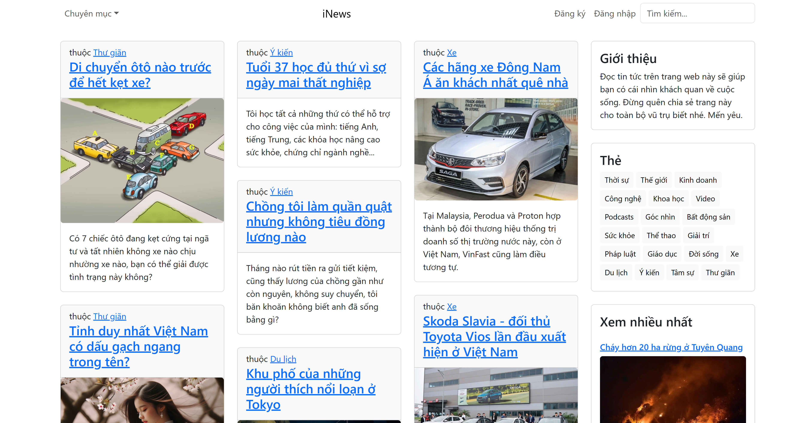

# Trang Tin Điện Tử - Node.js & MongoDB Atlas

Chào mừng đến với **Trang Tin Điện Tử**, một dự án web được xây dựng bằng Node.js kết hợp cơ sở dữ liệu MongoDB Atlas, hỗ trợ quản lý chủ đề, bài viết và tài khoản người dùng.

---

## Tính Năng

-   Quản lý **chủ đề**: tạo, sửa, xóa, hiển thị danh sách chủ đề
-   Quản lý **bài viết**: thêm, sửa, xóa, xem chi tiết bài viết
-   Quản lý **tài khoản**: đăng ký, đăng nhập, phân quyền người dùng
-   Tìm kiếm bài viết theo từ khóa hoặc chủ đề

## Công Nghệ Sử Dụng

-   **Node.js** – Nền tảng backend
-   **Express.js** – Framework tạo API nhanh gọn
-   **MongoDB Atlas** – Cơ sở dữ liệu NoSQL đám mây
-   **Render** – Nền tảng cloud để triển khai ứng dụng Node.js

---

## Hình Ảnh Minh Họa

---

## Tác Giả

-   **Dat Huynh** – [GitHub](https://github.com/dathuynh1710)
